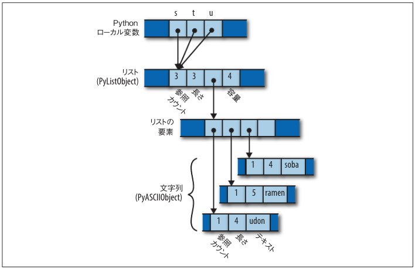
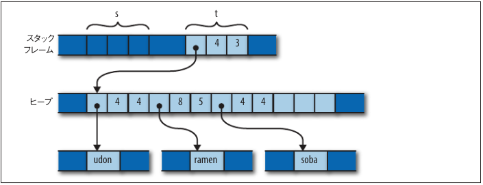

# memory

## Python

```python
s = ['udon', 'ramen', 'soba']
t = s
u = s
```



## C++

```c++
using namespace std;
vector<string> s = { "udon", "ramen", "soba" };
vector<string> t = s;
vector<string> u = s;
```


## rust

```rust
let s = vec!["udon".to_string(), "ramen".to_string(), "soba".to_string()];
let t = s;
let u = s;
```



if you want copy

```rust
let s = vec!["udon".to_string(), "ramen".to_string(), "soba".to_string()];
let t = s.clone();
let u = s.clone();
```
